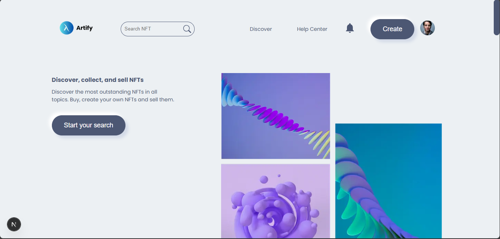
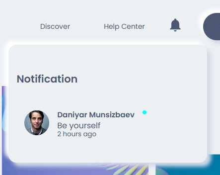
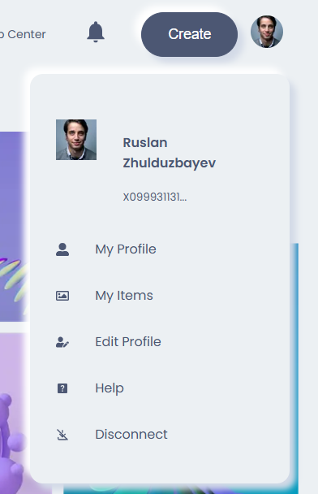
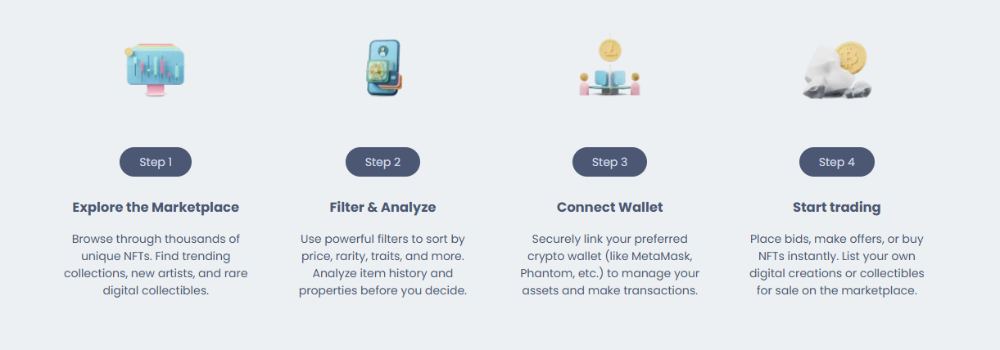
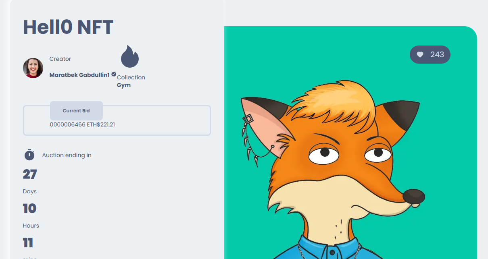
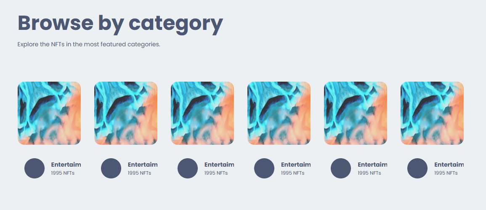

# "Artify" NFT Marketplace from Alikhan, Maksim, Alinur


## Description
This project is a decentralized NFT (Non-Fungible Token) marketplace built using modern web3 technologies. It allows users to connect their wallets, browse NFTs, create new NFTs (minting them on the blockchain), list them for sale, and purchase NFTs from other users. The project utilizes the Hardhat local network for smart contract deployment and interaction during development, Next.js for the user interface, and Pinata/IPFS for storing NFT metadata and assets off-chain.

## Features
Connect Ethereum wallets (e.g., MetaMask).
Browse listed NFTs on the marketplace.
View NFT details including image, description, price, owner, and seller.
Create (mint) new NFTs, uploading the associated image to IPFS via Pinata.
List owned NFTs for sale on the marketplace.
Buy NFTs listed by other users.
View NFTs owned or listed by the currently connected user (e.g., on an Author/Profile page).

 ## Tech Stack
Frontend: Next.js, React, CSS Modules
Blockchain Development: Hardhat, Solidity, Ethers.js (v6+)
Smart Contracts: OpenZeppelin Contracts
Decentralized Storage: IPFS (via Pinata API)
Wallet Connection: Web3Modal, Ethers.js
Node Package Manager: npm

## Getting Started
Follow these instructions to set up and run the project locally for development.

### Prerequisites
Node.js (v18 or later recommended)
npm (v8 or later recommended, comes with Node.js)
Git
MetaMask browser extension installed and set up

### Installation & Setup

**Clone the Repository:**
git clone https://github.com/ranzai32/nft-marketplace.git
cd connecting-contract

**Install Frontend Dependencies:**
(In the root directory)
```sh
npm install
```

**Create a file named .env.local in this root directory.**

Add your Pinata credentials to this file. You must include your Pinata Keys and your dedicated Gateway URL. Get these from your Pinata account's API Keys section after creating a key with 'Write' permissions for Files.

**.env.local**

NEXT_PUBLIC_PINATA_API_KEY=PASTE_YOUR_PINATA_API_KEY_HERE
NEXT_PUBLIC_PINATA_SECRET_API_KEY=PASTE_YOUR_PINATA_SECRET_API_KEY_HERE
NEXT_PUBLIC_PINATA_JWT=PASTE_YOUR_PINATA_JWT_HERE
NEXT_PUBLIC_PINATA_GATEWAY_URL=PASTE_YOUR_PINATA_GATEWAY_URL_HERE

**Running locally**

Start the local Hardhat blockchain node:
```sh
npx hardhat node
```

Run the deployment script targeting the local network:
```sh
npx hardhat run scripts/deploy.js --network localhost
```

**Update Frontend Configuration:**

Open the file in your frontend code where the contract address and ABI are defined (located at Context/constants.js or similar).
Find the variable holding the contract address (NFTMarketplaceAddress = "...").
Paste the new contract address you copied from Terminal 2 as the value for this variable.
(Optional but Recommended): If you have changed your NFTMarketplace.sol contract, ensure you have recompiled (npx hardhat compile in Terminal 2) and that the ABI in your constants file matches the latest version found in connecting-contract/artifacts/contracts/NFTMarketplace.sol/NFTMarketplace.json.
Save the constants file.

**Start Frontend Application:**

```sh
npm run dev
```

**Connect Wallet:**


Make sure your MetaMask wallet is installed and unlocked in the browser.
Ensure MetaMask is connected to the Localhost 8545 network (Network ID: 31337). If it's not present, you may need to add it manually in MetaMask's network settings.
Import one of the test accounts provided by the npx hardhat node output (using its private key) into MetaMask if you need test ETH for transactions on the local network.
Connect your wallet to the application using the "Connect" button.
*Important Note on Local Development:* Every time you stop and restart the Hardhat node (Terminal 1), the local blockchain state is reset. You must repeat Step 2 (Deploy Contract) and Step 3 (Update Frontend Config with the new address) to ensure your frontend interacts with the correct contract instance on the fresh local network.

## Functionality Demo







## License
Distributed under the MIT License.


