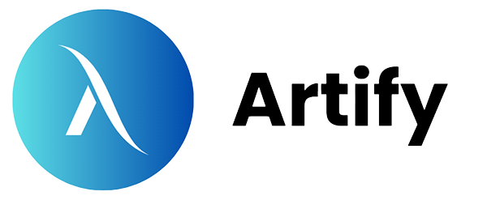

Welcome to Artify documentation!

We are using Docusaurus to provide it

<!-- truncate -->

Welcome to the official documentation and blog for **Artify**, our decentralized NFT Marketplace project! We're thrilled to have you here as we embark on this exciting journey into the world of Non-Fungible Tokens.

Artify is being built by Maxim and Alikhan with the goal of creating a user-friendly platform for discovering, creating, and trading unique digital assets. This space will serve as a hub for all things Artify – from development updates and feature showcases to insights into the web3 technologies powering our marketplace.

### What is Artify?

Artify is more than just a platform; it's a community-focused space designed to empower creators and collectors alike. Built with Next.js for a smooth frontend experience, Hardhat and Solidity for robust smart contracts, and IPFS (via Pinata) for decentralized storage, Artify aims to provide a seamless and secure environment for all your NFT activities.

Key features you can expect to learn more about include:

* **Wallet Integration:** Easily connect your Ethereum wallet (like MetaMask).
* **NFT Browsing & Discovery:** Explore a diverse range of NFTs.
* **Creation (Minting):** Upload your digital art and mint it as an NFT directly on the platform.
* **Trading:** Buy and sell NFTs with confidence.
* **User Profiles:** Showcase your collection and creations.

### What to Expect from This Blog

In this blog, we plan to share:

* **Development Progress:** Regular updates on new features and milestones.
* **Technical Deep Dives:** Insights into our smart contract development, frontend architecture, and IPFS integration.
* **Tutorials & Guides:** How-to articles for using Artify and understanding the underlying web3 concepts.
* **Community News:** Announcements and highlights from the Artify community.

We're leveraging the power of Docusaurus to build this documentation site, making it easy to navigate and find the information you need. You'll find detailed guides, API references (as they become available), and these blog posts to keep you informed.

We're excited to build Artify and share our progress with you. Stay tuned for more updates, and feel free to explore the rest of the documentation!

**The Artify Team**
(Alikhan, Maxim)